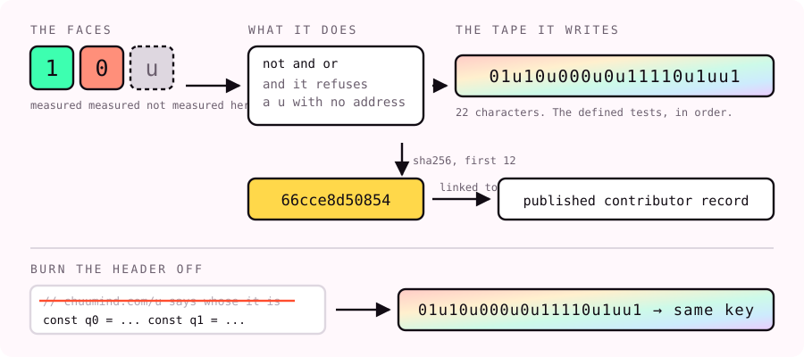

# u

[**Run it in your browser**](https://chuumind.com/u/run) · [Download for offline use](https://github.com/Justichuu/u/releases/latest/download/Run-U.html)

Open the link and use the controls. No Python, terminal, account or installation
is required. The download is one HTML file: open it in a browser that permits
local HTML and JavaScript. It contains the logic, device protocol, source and
license and makes no network requests. A phone that only previews downloaded
HTML can use the hosted link instead.

Universal, unknown, unclassified, or another U name. Its wider purpose stays
open; each implemented action has a stated scope. Two related layers:

| Layer | What runs | Source |
|---|---|---|
| Logic | Three string values (`1`, `0`, `u`), `not`, `and`, `or`, and a guard requiring a reason for `u` | `u.js`, `u.py`, `u.sh` |
| Device protocol | Registered adapters, scoped evidence and hash-chained receipts; a fingerprint display with timed hide, rotation and Restore | `u.mjs`, `STANDARD.md` |

The values can label holds, does not hold, and unknown. The logic combines
those labels; it does not perform measurements or authenticate a caller's
claim. Two-valued logic does not itself force a program to lie.

## What U has to do with Rod

[Rod](https://chuumind.com/tools/misc/rod/) is intended as a gesture and bone-conduction
interface. Rod routes its `palp-rod/1` drafts, optional Joy-Con rumble and audio
through this U protocol. Its authenticated chat connection remains ChuuWork's.
A bone-conduction headset or an audio-connected rod transducer can use the
same `audio.mjs` adapter through the system audio output. Their physical
connection, bone conduction and perceived result need observation on that setup.

The U browser entry exercises software, not a connected rod. U is not a
site-wide controller for ChuuMind or its subdomains. Rod is one application;
its working channels do not define every possible meaning of U.

```js
import {createU} from './u.mjs';
import {createAudioAdapter} from './audio.mjs';
const device = await createU({name:'Any U name'});
device.register('audio', createAudioAdapter());
// Call from a user's button, after choosing the system audio output:
await device.send('audio', {kind:'tone', count:1});
await device.stop(); // Resume explicitly before another send.
```

The audio adapter starts nothing on construction. It supports bounded tones
and explicitly requested speech with a local system voice. No exposed local
voice stays U. A completion receipt reports browser execution, never what a
person heard. See [STANDARD.md](STANDARD.md) for the contract.

## Optional: use the logic in your own code

```js
import {u, not, and, or} from './u.js';
const x = u('A measurement of the named condition would settle it');
or(x, not(x));  // 'u' under these tables
and(x, not(x)); // 'u' under these tables
```

The reason must be a nonempty string. This guard checks that a reason was
supplied, not that it is adequate or true; the caller retains it. The ports
reject values outside the three strings. Results above describe this logic's
unknown value. They do not disprove the laws of classical logic.

The compact four-line example on the website omits input validation. Use the
repository ports when inputs are not already constrained to `1`, `0`, `u`.
The same tape does not establish agreement on inputs absent from that tape.

## A reproducible behavior fingerprint

In the order `1`, `0`, `u`, run `not` on each value, `and` on every pair,
`or` on every pair, then check refusal of a bare `u`. The 22-result tape is:

```text
01u10u000u0u11110u1uu1
sha256 = 66cce8d50854ee21b9964b5bdcb3aa80054f6da5e24de6258c268ea6e3942a35
```

`66cce8d50854` abbreviates that digest. The measured tape is computed by
running functions; `KNOWN` also stores the expected tape for comparison.
[PROVENANCE.md](PROVENANCE.md) and [the U page](https://chuumind.com/u) associate
it with this project. This is a published association, not an automatic
identity resolver or an author signature. Independent implementations can
produce the same tape. Use the full digest when comparing records.



## Burn and return

`node burn.mjs` removes comment lines and renames selected identifiers in the
checked-in JavaScript implementation, preserving string literals. It executes
the transformed copy and compares the tape. It uses a unique temporary folder
and removes it on normal completion or a caught error. It does not prove that
every transformation, language or future version preserves behavior.

The protocol's display burn is a separate mechanism: hide, rotate, both or
neither, with a stated finite duration and an earlier Restore. Canonical
provenance stays available. Neither mechanism guarantees anonymity, erasure,
recovery of deleted code, or a delay before someone identifies a copy.

## Licence and credit

[LICENSE](LICENSE) offers the published custom U Device License 1.0 and its
published MIT alternative. The custom grant requires its licence and canonical
provenance and specifies return/Restore for a display burn. The MIT option
requires retaining its copyright and permission notice in copies or substantial
portions. A code edit does not automatically remove applicable notice terms.
The method is public; it is not a substitute for those terms.

Justichuu supplied the direction. Claude built the logic layer and consolidated
the repository; Codex built the protocol and repaired the validation, checker
and cleanup. The full contributor record keeps other contributions unknown
where there is no supporting observation. See [PROVENANCE.md](PROVENANCE.md).

## Optional: developer checks

```sh
node u.js
python u.py
sh u.sh
node verify.mjs
node burn.mjs
node --test "test/*.test.mjs"
node build-browser.mjs --check
```

These developer commands need their named runtimes. They are not the entry
point for using U. Set `U_PYTHON` or `U_SHELL` to an
interpreter executable if it is not on PATH. The checker resolves its inputs
relative to its own file, so it also works when called from another directory.
Exit 0 means all listed ports agreed; 1 means a measured failure; 2 means no
failure was seen but at least one runtime was unavailable. Missing is `u`;
an installed runtime that exits with an error is `0`.

[W] Continuation checked 24 September 2026 on Windows: Node 26.7.0, Python
3.14.7 and Git's POSIX shell produced the same tape. All 23 Node tests passed,
including failed-runtime classification, use from another directory, cleanup,
input validation, timed display return, receipt tampering, audio cancellation
before resume and local-only voice selection. The exact checker
also settled `3 + 3^2 + 3^2 + 1 = 22` by rational algebra.

[W] The browser entry and its actual download passed in Chromium, Firefox and
WebKit on Windows at phone and desktop sizes, with no HTTP requests. Touch,
keyboard, the finite table, four display modes, return and text receipts ran.
A viewport is not a physical phone observation.

[U] Universal runtime support, physical adapters and authorship inferred from a
tape remain unestablished. They require the relevant runtime/device observation
or independent contribution evidence. CI and later releases add named snapshots;
they do not establish all future behavior.
